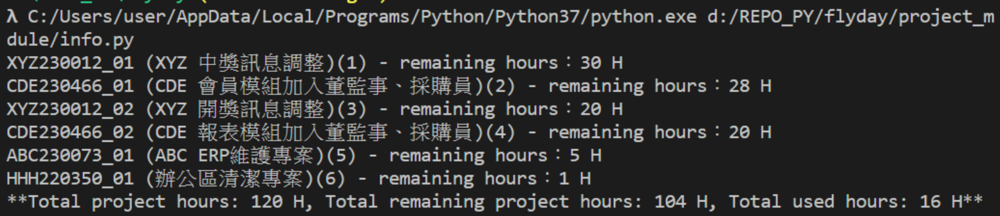

# Flyday: 智能工时调度师 
[](https://github.com/pigsly/flyday/actions/workflows/release.yml)

 [English Version](/readme.md)

欢迎来到 **Flyday**，智能工时调度师：减压报每日工时，释放创造力！，一款灵感来自着名的数据库迁移工具 **Flyway** 的直观软件。就像 Flyway 管理和协调您的数据库迁移一样，Flyday 确保您的日常任务能够通过 CSV 文件精确且高效地进行每日工作排程。

## 目录

- [介绍](#介绍)
- [安装](#安装)
- [使用方法](#使用方法)
  - [第一步，安排本月工作。](#第一步)
  - [第二步，审查配置](#第二步)
  - [指令](#指令)
- [贡献](#贡献)
- [许可证](#许可证)

## 介绍

Flyday 从数据库迁移的概念中汲取灵感，用于精简任务分配。它优先排序任务并在时间上分佈，让您跟踪工作时数并在必要时调整日程。

核心功能：

1. 使用 CSV 文件，便于在办公软件中查看和编辑。
2. 类似 Flyway 的命令管理，易于使用。
3. 可扩展的优先级算法。

输出展示：



## 安装

1. 克隆仓库：git clone <仓库地址>
2. 创建虚拟环境：
```bash
virtualenv venv
.\venv\Scripts\activate
```
3. 安装所需依赖：
```bash
pip install -r requirements.txt
```
4. 运行设置脚本（如果有）：
```bash
python setup.py install
```

## 第一步

- conf/ projects.json
您需要提供本月计划的项目，Flyday 将为您安排每天的任务。

- conf/ project_tasks.json
您可以定义项目类型，每种类型包含特定的任务。任务可以定义可用的工作时数。

## 第二步

在 conf/config.json 中:

- priority_method: 提供两种优先级算法。第一种是 LongestJobFirst，工时较长的项目具有更高的优先级。第二种是 AlternatingApproach，交替处理工时长短不一的项目集，以生成每日任务。这确保短期任务不会被过度延迟，适用于有突发休假或缺席的月份。默认设置为 AlternatingApproach。

- maxhours: 一天中的工作时数，以正整数表示。

- alternating_flag: 为 True 或 False，用于记录目的。

## 使用方法

安装后，您可以使用提供的指令来管理您的任务。

指令

- migrate
使用此指令生成基于每日优先级的工作计划。

```bash
migrate
```

- info
提供工作计划的当前状态概览。

```bash
info
```

- repair
如发现任务计划有差异，使用此指令重新安排 projects.json 中的优先级。优先级将根据 remaining_hours 进行调整。

```bash
repair
```

- undo
如果您想回退 Schedule.csv，并备份新的 Schedule_bak.csv，使用此指令撤销上一次任务迁移。

```bash
undo
```

## 许可证

根据 Apache License 分发。
